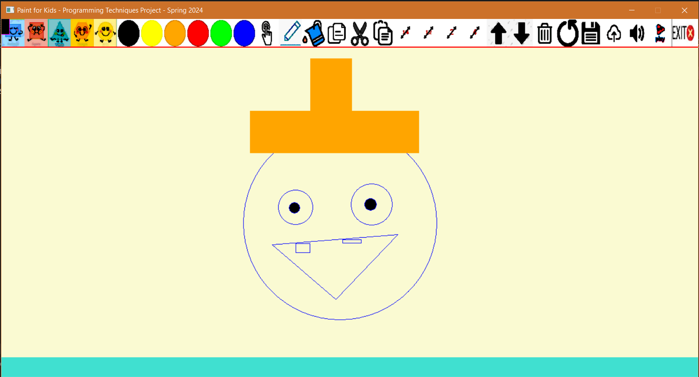
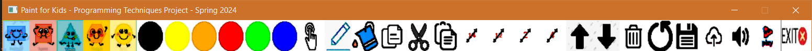
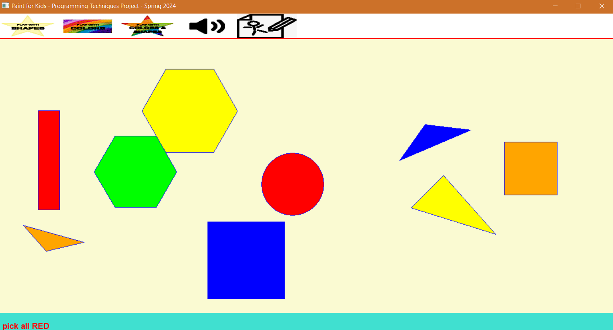
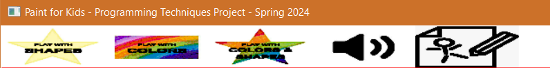

<a id="readme-top"></a>
[](https://www.linkedin.com/in/ibrahim-hesham-abdel-dayem/)

<!-- PROJECT LOGO -->
<br />
<div align="center">
  <a href="https://github.com/ibraaahim11/Paint-Play-For-Kids">

  </a>

<h3 align="center">Paint & Play For Kids</h3>

</div>

<!-- TABLE OF CONTENTS -->
<details>
  <summary>Table of Contents</summary>
  <ol>
    <li>
      <a href="#about-the-project">About The Project</a>
      <ul>
        <li><a href="#built-with">Built With</a></li>
      </ul>
    </li>
    <li><a href="#getting-started">Getting Started</a></li>
    <li><a href="#usage">Usage</a></li>
    <li><a href="#preview">Preview</a></li>
    <li><a href="#prerequisites">Prerequisites</a></li>
    <li><a href="#installation">Installation</a></li>
    <li><a href="#license">License</a></li>
  </ol>
</details>

<!-- ABOUT THE PROJECT -->

## <a id="about-the-project"></a>About The Project

Paint & Play For Kids is a fun and interactive C++ application designed to help children learn and recognize shapes and colors through drawing and playful challenges. The app provides two main modes: Draw Mode and Play Mode. Kids can freely create, edit, and manage shapes, then switch to playful mini-games that reinforce their understanding of shapes and colors. The project aims to make learning enjoyable and engaging for young users.

<p align="right">(<a href="#readme-top">back to top</a>)</p>

### <a id="built-with"></a>Built With

## 🛠️ Built With

[](https://isocpp.org/)

<p align="right">(<a href="#readme-top">back to top</a>)</p>

<!-- GETTING STARTED -->

## <a id="getting-started"></a>Getting Started

Follow these steps so you can Play & Paint locally.

<!-- USAGE EXAMPLES -->

## <a id="usage"></a>📖 Usage

1. **Draw Mode**

   - Start in Draw Mode, where you can pick from 5 different shapes and place them on the canvas.
   - Select one or more shapes to:
     - Copy and paste
     - Change border color or fill color
     - Delete shapes or clear the entire canvas
     - Save your drawing to a file (with a custom file name)
     - Import previously saved drawings to continue playing
   - A voice feature announces your actions in a funny voice for added fun.
   - _Note: Some features like cut, increase size, and bring back/forth were implemented in a lost version and are not available in this release._

2. **Play Mode**
   - Switch to Play Mode to play educational games:
     - **Play by Shape:** Find and select all shapes of a given type.
     - **Play by Color:** Find and select all shapes of a given color.
     - **Play by Shape and Color:** Find and select all shapes matching both a specific shape and color.
   - Earn a score based on your performance.
   - You can always switch back to Draw Mode to continue creating.

---

### <a id="preview"></a>🖼️ Preview

#### Draw Mode

- Place and edit shapes, change colors, and manage your drawing.



#### Draw Toolbar

- Access drawing tools, shape selection, color pickers, and file options.


#### Play Mode

- Play mini-games to identify shapes and colors.


#### Play Toolbar

- Access play mode controls and game options.



<p align="right">(<a href="#readme-top">back to top</a>)</p>

## <a id="prerequisites"></a>Prerequisites

Before running this project, make sure you have the following installed on your machine:

- [Visual Studio](https://visualstudio.microsoft.com/) (Community Edition or higher, recommended for C++ development)
- [Git](https://git-scm.com/) (for cloning the repository)

To verify installation:

```bash
git --version
```

### <a id="installation"></a>Installation

1. **Clone the repository**

   ```sh
   git clone https://github.com/ibraaahim11/Paint-Play-For-Kids.git
   ```

2. **Open the project in Visual Studio**

   - Launch Visual Studio.
   - Open the cloned folder.
   - Double-click on `PT-Project.sln` to open the solution.

3. **Build and Run**

   - Press `F5` or click the "Start" button in Visual Studio to build and run the project.

<p align="right">(<a href="#readme-top">back to top</a>)</p>

## <a id="license"></a>License

This project is intended for educational purposes only and is not licensed for commercial use or redistribution.

<p align="right">(<a href="#readme-top">back to top</a>)</p>
